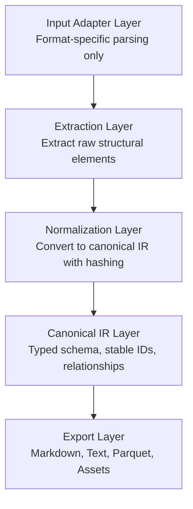

# Document IR - Production Document Ingestion Engine

**An IR-first, extensible document compiler for AI systems.**

This is NOT a PDF-to-Markdown script. It is a production-grade document ingestion and canonicalization engine designed with compiler-like architecture: Input → IR → Backends.

## Architecture

### Design Philosophy

Think like a compiler engineer:
- **Input Layer**: Format-specific parsers (currently PDF via Docling)
- **AST/IR**: Canonical intermediate representation with strict schema
- **Backends**: Multiple export formats (Markdown, Text, Parquet)

### Layer Separation (Non-Negotiable)



## Key Features

### ✅ Deterministic & Idempotent
- Hash-based stable IDs (document, block, table, image, chunk)
- Running pipeline twice produces identical output
- No UUIDs, no randomness

### ✅ Canonical IR Schema
```python
Document
├── document_id: str (hash-based)
├── schema_version: str
├── parser_version: str
├── metadata: DocumentMetadata
├── blocks: List[Block]
│   ├── block_id: str (deterministic)
│   ├── type: BlockType (heading, paragraph, table, image, etc.)
│   ├── content: str
│   ├── page_number: int
│   ├── bbox: BoundingBox
│   └── metadata: dict
└── relationships: List[Relationship]
```

### ✅ Pluggable Chunking
- `SemanticSectionChunker`: Section-based (headings)
- `TokenWindowChunker`: Fixed token windows with overlap
- `LayoutAwareChunker`: Layout-aware (stub)

All chunking operates on IR, not raw text.

### ✅ Multiple Export Formats
- **Markdown**: Human-readable with formatting
- **Plain Text**: Simple text extraction
- **Parquet**: Efficient structured storage for tables/blocks
- **Assets**: Extracted images (PNG) and tables (CSV)

### ✅ Structured Output
```
/<document_id>/
    manifest.json       # Processing metadata
    ir.json            # Canonical IR
    chunks.json        # Chunk definitions
    /assets/
        /images/       # Extracted images
        /tables/       # Tables as CSV
    /exports/
        /markdown/     # Markdown output
        /text/         # Plain text output
        /parquet/      # Parquet datasets
    /logs/             # Processing logs
```

## Installation

```bash
# Install from PyPI
pip install layoutir

# Or install from source
git clone https://github.com/RahulPatnaik/layoutir.git
cd layoutir
pip install -e .
```

## Usage

### Basic Usage

```bash
# Using the CLI
layoutir --input file.pdf --output ./out

# Or using Python directly
python -m layoutir.cli --input file.pdf --output ./out
```

### Advanced Options

```bash
# Semantic chunking (default)
layoutir --input file.pdf --output ./out --chunk-strategy semantic

# Token-based chunking with custom size
layoutir --input file.pdf --output ./out \
  --chunk-strategy token \
  --chunk-size 1024 \
  --chunk-overlap 128

# Enable GPU acceleration
layoutir --input file.pdf --output ./out --use-gpu

# Debug mode with structured logging
layoutir --input file.pdf --output ./out \
  --log-level DEBUG \
  --structured-logs
```

### Python API

```python
from pathlib import Path
from layoutir import Pipeline
from layoutir.adapters import DoclingAdapter
from layoutir.chunking import SemanticSectionChunker

# Create pipeline
adapter = DoclingAdapter(use_gpu=True)
chunker = SemanticSectionChunker(max_heading_level=2)
pipeline = Pipeline(adapter=adapter, chunk_strategy=chunker)

# Process document
document = pipeline.process(
    input_path=Path("document.pdf"),
    output_dir=Path("./output")
)

# Access results
print(f"Extracted {len(document.blocks)} blocks")
print(f"Document ID: {document.document_id}")
```

## Project Structure

```
src/layoutir/
├── schema.py              # Canonical IR schema (Pydantic)
├── pipeline.py            # Main orchestrator
│
├── adapters/              # Input adapters
│   ├── base.py           # Abstract interface
│   └── docling_adapter.py # PDF via Docling
│
├── extraction/            # Raw element extraction
│   └── docling_extractor.py
│
├── normalization/         # IR normalization
│   └── normalizer.py
│
├── chunking/              # Chunking strategies
│   └── strategies.py
│
├── exporters/             # Export backends
│   ├── markdown_exporter.py
│   ├── text_exporter.py
│   ├── parquet_exporter.py
│   └── asset_writer.py
│
└── utils/
    ├── hashing.py        # Deterministic ID generation
    └── logging_config.py  # Structured logging

ingest.py                  # CLI entrypoint
benchmark.py               # Performance benchmark
test_pipeline.py           # Integration test
```

## Design Constraints

### ✅ What We DO
- Strict layer separation
- Deterministic processing
- Schema validation
- Pluggable strategies
- Observability/timing
- Efficient storage (Parquet)

### ❌ What We DON'T DO
- Mix business logic into adapters
- Hardcode paths or configurations
- Use non-deterministic IDs (UUIDs)
- Combine IR and export logic
- Skip schema validation
- Load entire files into memory unnecessarily

## Extensibility

### Adding New Input Formats

1. Implement `InputAdapter` interface:
```python
class DocxAdapter(InputAdapter):
    def parse(self, file_path: Path) -> Any: ...
    def supports_format(self, file_path: Path) -> bool: ...
    def get_parser_version(self) -> str: ...
```

2. Implement corresponding extractor
3. Update pipeline to use new adapter

### Adding New Chunk Strategies

```python
class CustomChunker(ChunkStrategy):
    def chunk(self, document: Document) -> List[Chunk]:
        # Operate on IR blocks
        ...
```

### Adding New Export Formats

```python
class JsonExporter(Exporter):
    def export(self, document: Document, output_dir: Path, chunks: List[Chunk]):
        # Export from canonical IR
        ...
```

## Performance

Designed to handle 200+ page PDFs efficiently:
- Streaming processing where possible
- Lazy loading of heavy dependencies
- GPU acceleration support
- Parallel export operations
- Efficient Parquet storage for tables

## Observability

- Structured JSON logging
- Stage-level timing metrics
- Extraction statistics
- Deterministic output for debugging

## Schema Versioning

Current schema version: `1.0.0`

Future schema changes will be tracked via semantic versioning:
- Major: Breaking changes to IR structure
- Minor: Backwards-compatible additions
- Patch: Bug fixes

## Future Enhancements

- [ ] DOCX input adapter
- [ ] HTML input adapter
- [ ] Advanced layout-aware chunking
- [ ] Parallel page processing
- [ ] Incremental updates (only reprocess changed pages)
- [ ] Vector embeddings export
- [ ] OCR fallback for scanned PDFs

## License

See project root for license information.

## Contributing

This is a research/prototype phase project. See main project README for contribution guidelines.
# layoutir
