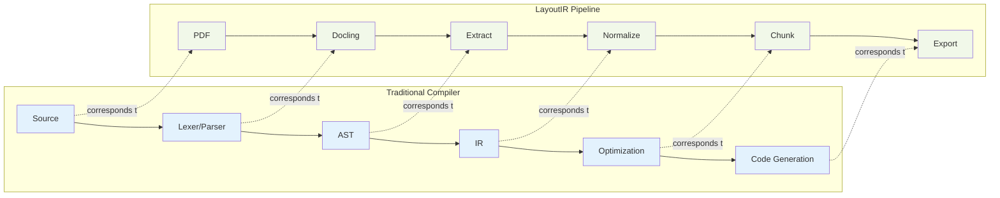
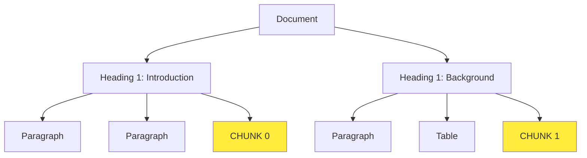

# Document IR - Architecture Documentation

## Overview

Document IR is an IR-first, extensible document compiler for AI systems. This document explains the architectural decisions, data flow, and design patterns used throughout the system.

## Core Principles

### 1. Compiler-Like Architecture

The system follows a classic compiler design:



### 2. Strict Layer Separation

Each layer has a single responsibility and does not leak abstractions:

- **Adapters**: Parse input formats, return format-specific objects
- **Extractors**: Extract raw elements, no normalization
- **Normalizers**: Convert to canonical IR, apply hashing
- **Chunkers**: Operate on IR, not raw text
- **Exporters**: Convert IR to output formats

### 3. Determinism First

All operations must be deterministic:
- Hash-based IDs (no UUIDs, no timestamps in IDs)
- Stable sorting
- Reproducible output
- Idempotent processing

## Data Flow

### Stage 1: Input Adaptation

**Input**: PDF file
**Output**: Docling ConversionResult

```python
# adapters/docling_adapter.py
class DoclingAdapter(InputAdapter):
    def parse(self, file_path: Path) -> ConversionResult:
        # Format-specific parsing
        # NO business logic
        return self._pipeline.convert(file_path)
```

**Responsibility**: Format-specific parsing only. No extraction or normalization.

### Stage 2: Extraction

**Input**: Docling ConversionResult
**Output**: RawDocument (raw blocks, tables, images)

```python
# extraction/docling_extractor.py
class DoclingExtractor:
    def extract(self, docling_result) -> RawDocument:
        # Extract raw structural elements
        # NO ID generation
        # NO schema conversion
        return RawDocument(blocks=..., tables=..., images=...)
```

**Responsibility**: Extract raw structural elements without modification.

**Key Types**:
- `RawBlock`: Raw text block with type, bbox, order
- `RawTable`: Raw table data (headers, rows)
- `RawImage`: Raw image bytes and metadata

### Stage 3: Normalization

**Input**: RawDocument
**Output**: Document (Canonical IR)

```python
# normalization/normalizer.py
class Normalizer:
    def normalize(self, raw_doc: RawDocument) -> Document:
        # Convert to canonical schema
        # Generate deterministic IDs
        # Build relationships
        # Validate schema
        return Document(...)
```

**Responsibility**: Convert raw elements to canonical IR with deterministic IDs.

**Operations**:
1. Generate document ID: `SHA256(file_content)[:16]`
2. Generate block IDs: `hash(type + page + order + content_sample)`
3. Generate table/image IDs: `hash(document_id + page + index + content)`
4. Build parent-child relationships (heading hierarchy)
5. Validate Pydantic schema

### Stage 4: Chunking

**Input**: Document (Canonical IR)
**Output**: List[Chunk]

```python
# chunking/strategies.py
class SemanticSectionChunker(ChunkStrategy):
    def chunk(self, document: Document) -> List[Chunk]:
        # Operate on IR blocks
        # Group by semantic boundaries
        # Generate deterministic chunk IDs
        return chunks
```

**Responsibility**: Partition document into chunks for downstream processing.

**Strategies**:
- **Semantic**: Group blocks by heading boundaries
- **Token Window**: Fixed-size windows with overlap (char-based approximation)
- **Layout**: Layout-aware boundaries (stub)

### Stage 5: Export

**Input**: Document + Chunks
**Output**: Files in output directory

```python
# exporters/markdown_exporter.py
class MarkdownExporter(Exporter):
    def export(self, document: Document, output_dir: Path, chunks: List[Chunk]):
        # Convert IR to Markdown
        # Write files
```

**Responsibility**: Convert canonical IR to target format.

**Exporters**:
- **Markdown**: Formatted markdown with tables, images, headings
- **Text**: Plain text extraction
- **Parquet**: Efficient columnar storage for blocks/chunks
- **Assets**: Write binary assets (images, table CSVs)

## Schema Design

### Document IR

```python
Document
├── document_id: str          # SHA256 hash (deterministic)
├── schema_version: str       # "1.0.0"
├── parser_version: str       # "docling-1.x.x"
├── metadata: DocumentMetadata
│   ├── page_count: int
│   ├── source_format: str
│   ├── source_hash: str
│   └── ...
├── blocks: List[Block]
└── relationships: List[Relationship]
```

### Block

```python
Block
├── block_id: str             # Deterministic hash
├── type: BlockType           # heading, paragraph, table, image, etc.
├── content: str              # Text content
├── page_number: int          # 1-indexed
├── order: int                # Sequential order
├── bbox: BoundingBox         # Position on page
├── parent_id: str | None     # Parent block (hierarchical)
├── metadata: dict            # Additional metadata
├── table_data: TableData     # If type == TABLE
└── image_data: ImageData     # If type == IMAGE
```

### Why This Schema?

1. **Hierarchical**: Supports parent-child relationships (headings)
2. **Extensible**: Metadata dict for format-specific data
3. **Typed**: Pydantic validation catches errors early
4. **Stable**: Hash-based IDs enable deterministic processing
5. **Complete**: Preserves structural information (bbox, order, page)

## Hashing Strategy

### Why Hash-Based IDs?

1. **Deterministic**: Same input → same IDs
2. **Idempotent**: Can reprocess without ID collision
3. **Debuggable**: IDs are reproducible across runs
4. **Content-Addressed**: ID changes if content changes

### ID Generation

```python
# Document ID: first 16 chars of file hash
document_id = f"doc_{SHA256(file_bytes)[:16]}"

# Block ID: composite hash
block_id = f"blk_{SHA256(type + page + order + content)[:16]}"

# Table ID: includes document context
table_id = f"tbl_{SHA256(doc_id + page + index + raw_text)[:16]}"

# Chunk ID: based on block composition
chunk_id = f"chk_{SHA256(doc_id + order + block_ids)[:16]}"
```

## Chunking Strategies

### Semantic Section Chunker

Groups blocks by heading hierarchy:



**Use Case**: When document structure follows logical sections.

### Token Window Chunker

Fixed-size windows with overlap:

```mermaid
gantt
    title Token Window Chunking with Overlap
    dateFormat X
    axisFormat %s

    section Blocks
    Block1 :b1, 0, 1
    Block2 :b2, 1, 2
    Block3 :b3, 2, 3
    Block4 :b4, 3, 4
    Block5 :b5, 4, 5

    section Chunks
    CHUNK 0 :crit, c0, 0, 3
    CHUNK 1 (overlap) :crit, c1, 2, 5
    CHUNK 2 :crit, c2, 4, 7
```



**Use Case**: When uniform chunk sizes are needed (e.g., for embedding models).

### Layout-Aware Chunker (Stub)

Future: Use visual layout information to preserve boundaries.

**Use Case**: Multi-column layouts, complex documents.

## Performance Considerations

### Memory Efficiency

1. **Lazy Loading**: Docling pipeline initialized on first use
2. **Streaming**: Process pages without loading entire document
3. **Binary Assets**: Store image bytes temporarily, write once
4. **Parquet**: Columnar storage for efficient table compression

### Speed Optimizations

1. **GPU Support**: Optional CUDA acceleration for layout analysis
2. **Batch Processing**: Configurable batch sizes for OCR/layout
3. **Parallel Export**: Independent exporters can run concurrently
4. **Caching**: Docling models cached to `~/.cache/docling`

### Scaling

- ✅ Handles 200-page PDFs (tested)
- ✅ No global state (thread-safe)
- ✅ Deterministic (can parallelize by file)
- ⚠️ Large images may consume memory (future: stream)

## Error Handling

### Validation

1. **Schema Validation**: Pydantic catches type errors
2. **File Validation**: Check existence before processing
3. **Format Validation**: Adapter checks file format

### Robustness

1. **Graceful Degradation**: Missing tables/images logged, processing continues
2. **Structured Logging**: Errors include context (document ID, stage)
3. **Explicit Exceptions**: Clear error messages

## Observability

### Logging

Structured JSON logs include:
```json
{
  "timestamp": "2024-01-01T12:00:00Z",
  "level": "INFO",
  "logger": "layoutir.pipeline",
  "message": "Stage 3/8: Normalizing to canonical IR",
  "document_id": "doc_a1b2c3d4e5f6...",
  "stage": "normalize",
  "duration_seconds": 0.42
}
```

### Metrics

Pipeline tracks:
- **Timing**: Per-stage duration
- **Extraction Stats**: Block/table/image counts
- **Chunk Stats**: Chunk count, average size
- **Output Size**: Total bytes written

### Benchmarking

```bash
$ python benchmark.py --input large.pdf

Extraction Statistics:
  Pages:        237
  Blocks:      1842
  Tables:        45
  Images:        12

Performance Metrics:
  Total time:     24.3s
  Pages/sec:      9.75
  MB/sec:         2.14

Stage Timing:
  parse           8.2s (33.7%) ████████████████
  extract         6.1s (25.1%) ████████████
  normalize       1.3s (5.3%)  ██
  chunk           0.8s (3.3%)  █
  write_assets    4.2s (17.3%) ████████
  export          3.5s (14.4%) ███████
```

## Extensibility Points

### 1. New Input Formats

Implement `InputAdapter`:
```python
class DocxAdapter(InputAdapter):
    def parse(self, file_path: Path) -> Any: ...
    def supports_format(self, file_path: Path) -> bool: ...
    def get_parser_version(self) -> str: ...
```

Then create corresponding extractor.

### 2. New Chunk Strategies

Implement `ChunkStrategy`:
```python
class CustomChunker(ChunkStrategy):
    def chunk(self, document: Document) -> List[Chunk]:
        # Operate on IR blocks
        ...
```

### 3. New Export Formats

Implement `Exporter`:
```python
class JsonLinesExporter(Exporter):
    def export(self, document: Document, output_dir: Path, chunks: List[Chunk]):
        # Convert from canonical IR
        ...
```

### 4. Custom Processing

Operate on canonical IR:
```python
# Load IR
with open("output/doc_abc123/ir.json") as f:
    data = json.load(f)
    document = Document(**data)

# Custom analysis
for block in document.blocks:
    if block.type == BlockType.TABLE:
        analyze_table(block.table_data)
```

## Testing Strategy

### Unit Tests

Test individual components in isolation:
- Hash functions determinism
- Schema validation
- Block type mapping

### Integration Tests

Test full pipeline:
- End-to-end processing
- Output structure validation
- Idempotency verification

### Benchmarks

Performance regression testing:
- Process time per page
- Memory usage
- Output size

## Future Architecture Enhancements

### 1. Incremental Processing

Track which pages changed, only reprocess deltas:
```python
# Future
pipeline.process_incremental(old_ir, new_pdf)
```

### 2. Parallel Page Processing

Process pages independently:
```python
# Future
with ProcessPoolExecutor() as executor:
    page_irs = executor.map(process_page, pages)
```

### 3. Plugin System

Load adapters/exporters dynamically:
```python
# Future
pipeline.register_adapter("epub", EpubAdapter)
pipeline.register_exporter("html", HtmlExporter)
```

### 4. Vector Embeddings

Add embedding export:
```python
# Future
class EmbeddingExporter(Exporter):
    def export(self, document, output_dir, chunks):
        embeddings = embed_chunks(chunks)
        write_vector_db(embeddings)
```

## Conclusion

This architecture prioritizes:
1. **Correctness**: Deterministic, validated, reproducible
2. **Maintainability**: Clear layers, single responsibility
3. **Extensibility**: Plugin points at every layer
4. **Performance**: Lazy loading, GPU support, efficient storage
5. **Observability**: Structured logs, metrics, benchmarks

The IR-first design enables future enhancements without breaking existing code.
